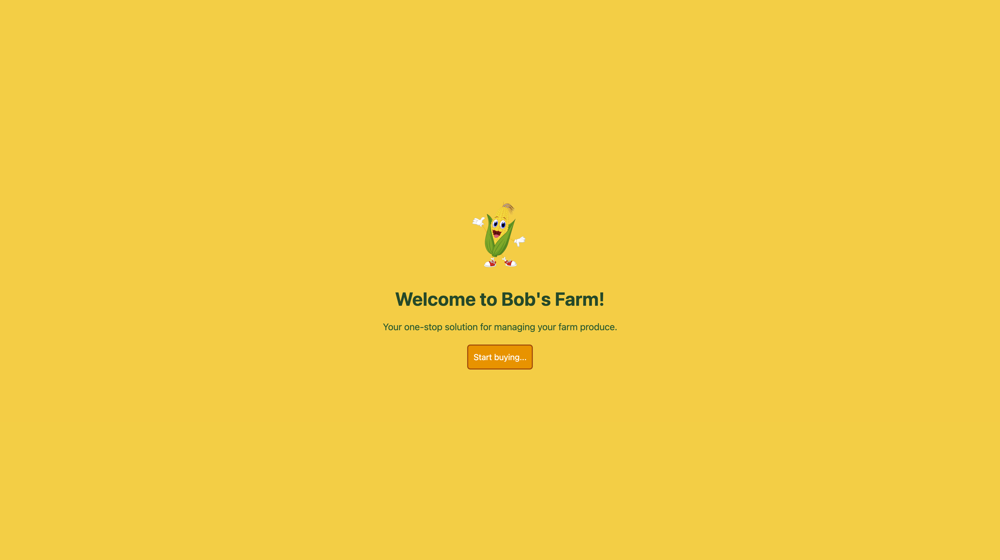
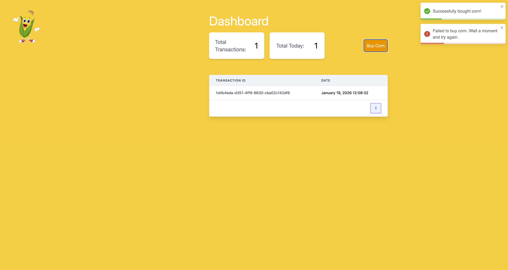
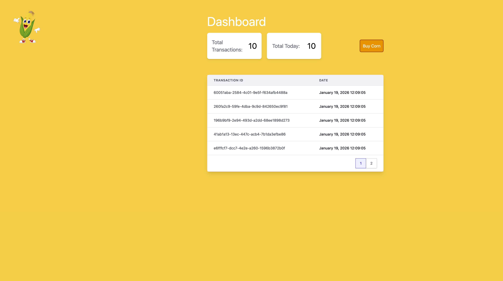
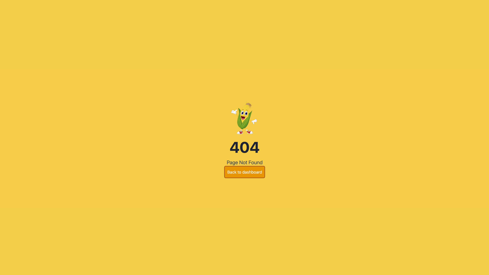
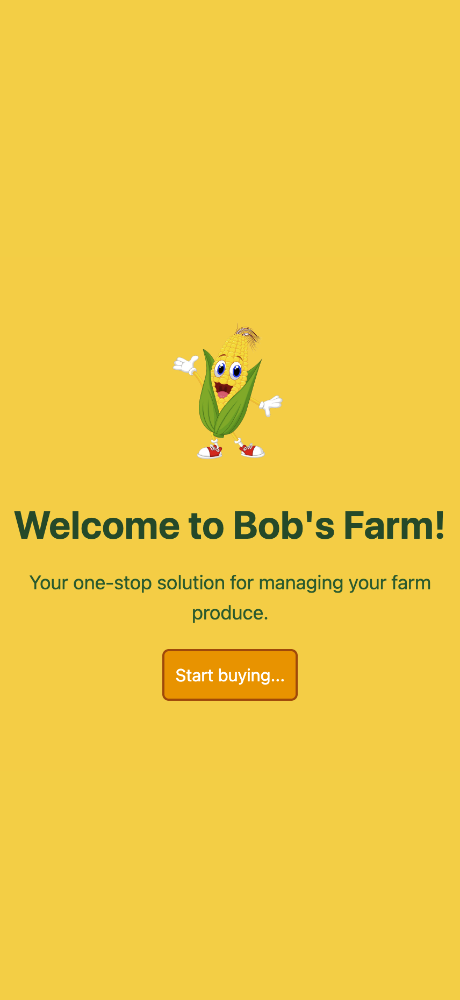
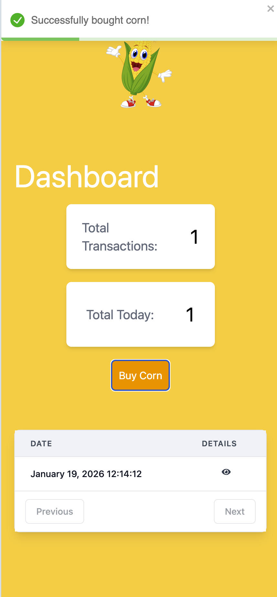
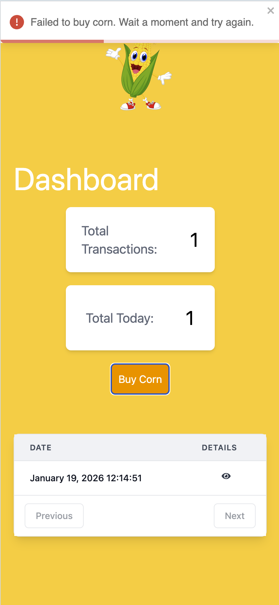

# Project setup

In order to run the project, simply run the following commands at the root project folder:
`npm i && npm run start`

## BE Api

Application built using Node.js. It features the following API's:

- `GET api/corn`:
  - Return a paginated list of the transactions
  - Query Params: `pageNumber`, `pageSize`
  - Returns:
    ```
    {
      data: {
          id: number,
          date: Date
      }[],
      pageNumber: number,
      pageSize: number,
      totalPages: number,
      counters: {
          total: number,
          today: number,
      }
    }
    ```

- `POST api/corn`
  - Submit a new transaction. It validates whether the action is between the allowed range.
  - Body: -
  - Response:
  - Status code 201 - Success
  - Status code 429 - Failure - Rate limit exceeded

## UI Web App

This application is based on Vite React template and uses the following main libraries:

- React
- Typescript
- TailwindCSS
- React-Router
- React-Toastify
- React-Tooltip

### Desktop Features

- Desktop
  - Welcome page
    
  - Process
    
  - Pagination
    
  - Not Found page
    

- Mobile
  - Welcome page
    
  - Sucess
    
  - Failure
    
  - Not Found page
    
